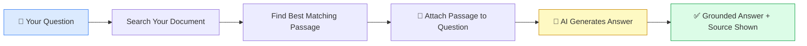
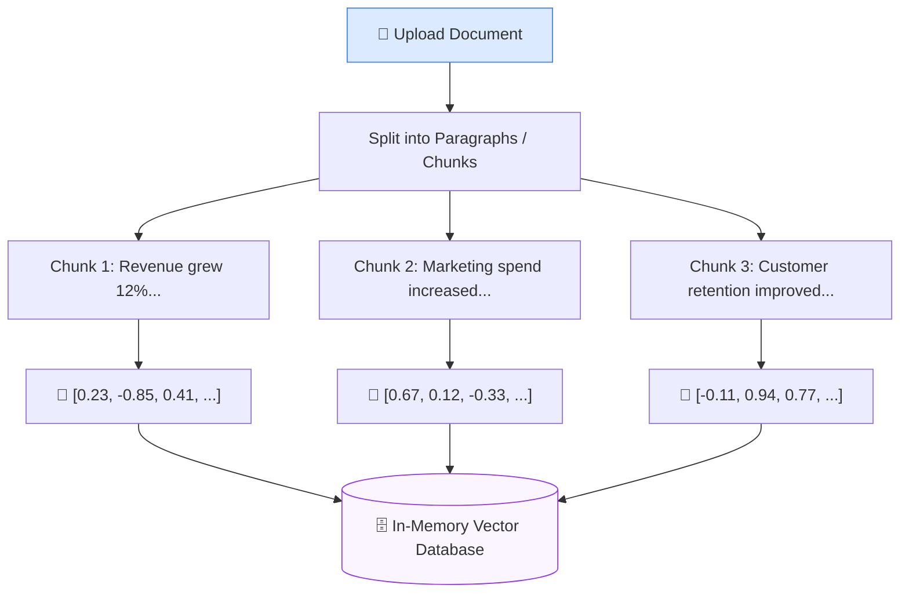
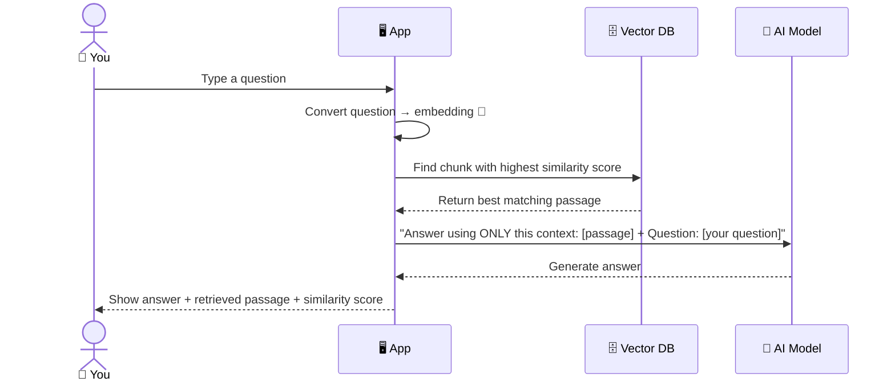
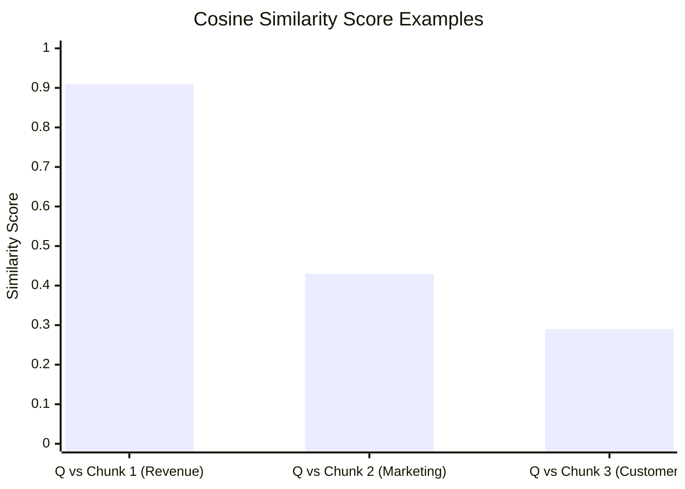
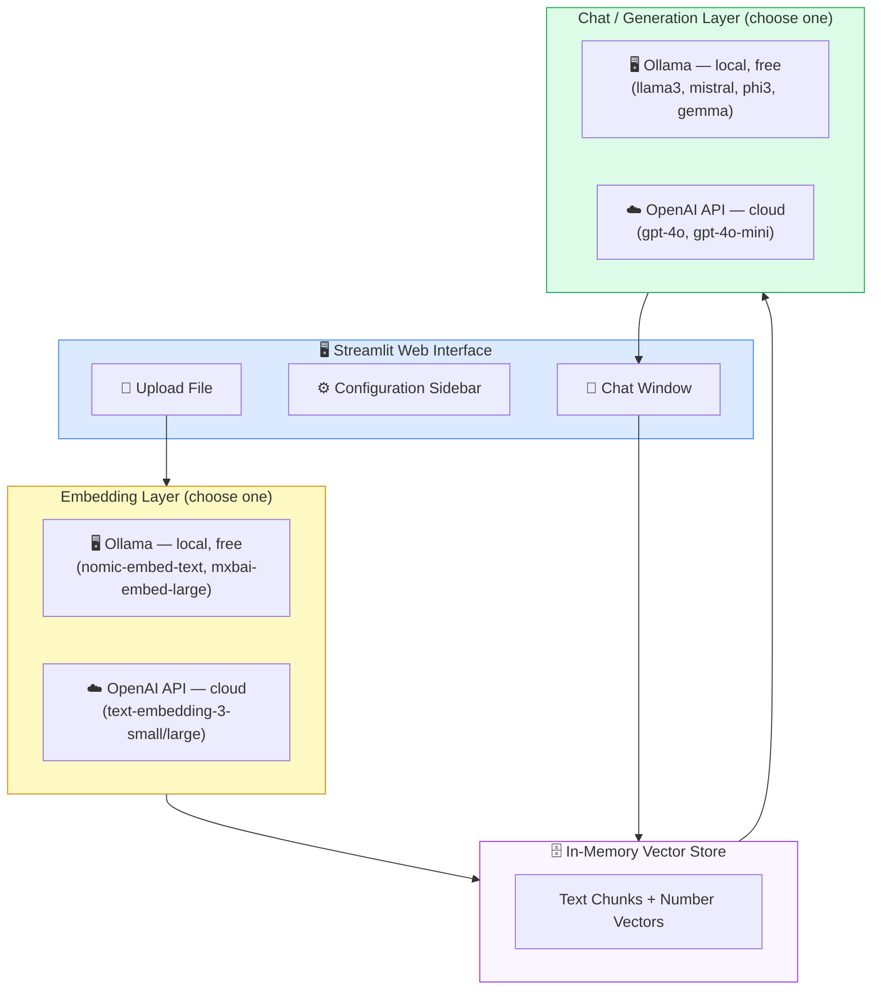
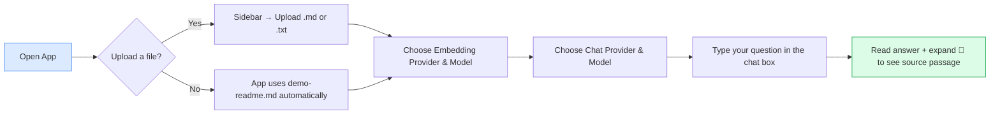

# Custom RAG Chat — Interactive Document Q&A

> **Who is this for?** Business students who want to understand and run an AI-powered document Q&A tool — no prior machine learning experience required.

---

## What Does This App Do?

Imagine uploading your lecture notes, a company report, or any text file, and then being able to *chat* with it — asking questions and getting accurate, sourced answers in seconds.

That is exactly what this app does. It uses a technique called **Retrieval-Augmented Generation (RAG)** to make an AI answer questions *only* from the document you provide, not from vague general knowledge.

---

## The Big Idea: What is RAG?

Standard AI chat tools (like ChatGPT) answer from broadly trained knowledge. The risk: they can "hallucinate" — confidently stating things that are wrong, especially about your specific documents or data.

**RAG solves this** by forcing the AI to first *find the relevant passage* in your document, then use it as the only source for its answer.



The AI becomes your **document expert** rather than a generic chatbot.

---

## How It Works — Step by Step

### Phase 1 — Turning Your Document into a Searchable Database

When you upload a file, the app cannot search it like a keyword search engine. Instead, it converts every paragraph into a list of numbers called an **embedding** — a mathematical fingerprint of that text's *meaning*.



> **Analogy:** Think of an embedding like a GPS coordinate for meaning. Two sentences with similar meanings will have coordinates that are close together, even if they use different words.

### Phase 2 — Answering Your Question

When you type a question, the app runs the same "meaning fingerprint" process on your question, then finds which stored chunk is closest in meaning.



---

## What is Cosine Similarity?

The app uses **cosine similarity** to measure how closely related your question is to each stored chunk. The score ranges from **0** (completely unrelated) to **1** (identical meaning).



The chunk with the highest score wins — its text is injected directly into the AI's prompt as context.

> **Business analogy:** It is like a talent recruiter comparing your resume to a job description. The closer your skills match the requirements, the higher the relevance score.

---

## App Architecture



---

## Local vs Cloud Models

One unique feature of this app is the ability to run **100% locally** using [Ollama](https://ollama.com) — meaning your document never leaves your computer.

| Feature | Ollama (Local) | OpenAI (Cloud) |
|---|---|---|
| **Cost** | Free | Pay per use |
| **Privacy** | Data stays on your machine | Data sent to OpenAI |
| **Speed** | Depends on your hardware | Fast, consistent |
| **Internet needed** | No | Yes |
| **Setup** | Install Ollama + pull model | Just add API key |

---

## Getting Started

### Prerequisites

- Python 3.10 or higher
- [Ollama](https://ollama.com) installed (if you want the free local option)

### 1 — Install Python dependencies

```bash
cd ollama
pip install -r requirements.txt
```

### 2 — (Optional) Set up your OpenAI key

If you plan to use OpenAI models, copy the sample env file and add your key:

```bash
cp env.sample .env
# Open .env and replace sk-proj-XXX with your real key
```

### 3 — (Optional) Pull local models with Ollama

```bash
ollama pull nomic-embed-text   # embedding model
ollama pull llama3              # chat model
```

### 4 — Run the app

```bash
streamlit run rag-app-readme-streamlit.py
```

Your browser will open automatically at `http://localhost:8501`.

---

## Using the App



### Sidebar Options Explained

| Setting | What It Does |
|---|---|
| **Upload File** | The document the AI will be limited to |
| **System Prompt** | Hidden instructions that shape the AI's behaviour |
| **Embedding Provider** | Who converts text to numbers (Ollama = local, OpenAI = cloud) |
| **Embedding Model** | The specific model that creates the number fingerprints |
| **Chat Provider** | Who generates the final answer |
| **Chat Model** | The specific AI model that writes the response |
| **OpenAI API Key** | Required only when using OpenAI; loaded from `.env` automatically |
| **Clear Chat History** | Resets the conversation without reloading the document |

---

## Understanding the Similarity Score

After every answer, the app shows a **Retrieved context** panel with a score like `0.8732`. Here is how to interpret it:

| Score Range | Meaning |
|---|---|
| **0.85 – 1.00** | Excellent match — the answer is very well supported |
| **0.65 – 0.84** | Good match — answer is likely relevant |
| **0.40 – 0.64** | Weak match — the document may not contain the answer |
| **Below 0.40** | Poor match — consider rephrasing or checking your document |

---

## Key Concepts Glossary

| Term | Plain English Explanation |
|---|---|
| **RAG** | Make the AI answer *from your document* instead of general memory |
| **Embedding** | A list of numbers that captures the *meaning* of text |
| **Vector Database** | A storage system for those number lists, optimised for meaning-based search |
| **Cosine Similarity** | A score (0–1) measuring how close two meanings are |
| **Chunk** | A paragraph-sized piece of the document |
| **LLM** | Large Language Model — the AI engine that writes human-like text |
| **Ollama** | Free software to run AI models on your own computer |
| **System Prompt** | A hidden instruction given to the AI before your conversation starts |

---

## Project File Structure

```
ollama/
├── rag-app-readme-streamlit.py   ← this app
├── demo-readme.md                ← default document loaded if nothing is uploaded
├── requirements.txt              ← Python package list
├── env.sample                    ← template for your API key
└── .env                          ← your actual API key (create from env.sample)
```

---

## Troubleshooting

| Problem | Likely Cause | Fix |
|---|---|---|
| *"Failed to initialise embedding model"* | Ollama is not running | Run `ollama serve` in a terminal |
| *"No valid text found"* | File is empty or binary | Upload a plain `.txt` or `.md` file |
| *"OpenAI API key required"* | OpenAI selected but no key set | Add key to `.env` or paste it in the sidebar |
| Model not found error | Ollama model not downloaded | Run `ollama pull <model-name>` |
| App does not open | Port conflict | Try `streamlit run rag-app-readme-streamlit.py --server.port 8502` |
